# Context
MVP conversational agent to help with meal planning and grocery shopping organization.

**Target users**: Personal use + 5-10 friends/family for early testing and feedback.

**Core value proposition**: Reduce mental load of weekly meal planning by providing personalized menus and automated shopping lists via WhatsApp.

# Features
## LOT1 Features (MVP)
F1.1: Generate weekly meal plan
F1.2: Generate shopping list from validated meal plan
F1.3: Import recipes automatically from screenshots/photo
F1.4: Import shopping tickets photo or drive screenshots for shopping list management

# Coding Rules
- Python 3.13+ as primary language
- Use `uv` for dependency management
- English for everything: code, comments, docs, commits, variable names
- Type hints required for all functions
- Follow PEP 8 style guide
- Write tests with pytest for all critical paths
- Mock external APIs in tests (OpenRouter, WhatsApp)


# Architecture

```mermaid
flowchart TB
    phone["📱 WhatsApp"] -->|webhook| api["⚙️ FastAPI<br/>(Railway)"]
    api -->|prompt + context| llm["🧠 LLM via OpenRouter<br/>(Qwen 3.5 Plus)"]
    llm -->|response| api
    api -->|read/write| db["🗄️ Neon PostgreSQL<br/>(users, recipes,<br/>meal plans, feedback)"]
    api -->|message| phone
```




**WhatsApp as UI**: No frontend. Meta Cloud API (free tier). Interactive interface with buttons and lists.

**FastAPI backend**: Handles all LLM calls, user context management, webhook processing.

**Database**: Neon PostgreSQL for storing users, recipes, meal plans, preferences, feedback. pgVector extension for semantic recipe search (LOT2).

**Authentication**: Start simple with WhatsApp phone number as user ID. Auth0 or Supabase Auth for LOT2 if needed.

**LLM**: Qwen 3.5 Plus via OpenRouter (cost-effective, reasoning enabled). Can switch models easily via constants.py.

**Hosting**: Railway.app (affordable for MVP, easy deployment, auto-deploy from GitHub).

**Supermarket integration**: Deferred to LOT2. Will use Playwright for web automation when ready.

## Tech Stack Summary
- **Language**: Python 3.13
- **Web framework**: FastAPI 0.129+
- **Dependency manager**: uv
- **Database**: Neon PostgreSQL + SQLAlchemy ORM (Week 3)
- **LLM**: OpenRouter API (Qwen 3.5 Plus with reasoning)
- **Messaging**: Meta WhatsApp Cloud API
- **Hosting**: Railway (auto-deploy from GitHub)
- **Testing**: pytest with pytest-asyncio and pytest-mock

## Project Structure
```
botatouille/
├── app/
│   ├── api/          # API routes (webhook endpoints)
│   ├── core/         # Config, constants, settings
│   ├── models/       # Data models (Pydantic, SQLAlchemy)
│   └── services/     # Business logic (LLM service)
├── tests/            # pytest unit and integration tests
├── examples/         # Demo scripts for manual testing
├── docs/             # Additional documentation
├── main.py           # Application entry point
├── railway.json      # Railway deployment config
└── pyproject.toml    # Project dependencies and config
```

## Environment Variables
```bash
# Required for MVP
OPENROUTER_API_KEY=sk-or-v1-...
WHATSAPP_VERIFY_TOKEN=your_random_token
WHATSAPP_ACCESS_TOKEN=your_meta_token
WHATSAPP_PHONE_NUMBER_ID=your_phone_id

# Database (Week 3+)
DATABASE_URL=postgresql://...

# Optional
LOG_LEVEL=INFO          # Use DEBUG for local development
ENVIRONMENT=production   # development, staging, production
OPENROUTER_APP_NAME=Botatouille
OPENROUTER_SITE_URL=https://github.com/mazelx/botatouille
```

## Testing

### Run tests
```bash
# All tests
uv run pytest

# Unit tests only (fast, mocked)
uv run pytest -m unit

# Integration tests
uv run pytest -m integration

# With coverage
uv run pytest --cov=app --cov-report=html
```

### Test structure
- **tests/test_llm_service.py**: Unit tests for LLM service (6 tests)
- **tests/test_webhook_api.py**: Integration tests for webhook (9 tests)
- **tests/conftest.py**: Shared fixtures (client, llm_service, mock data)
- **examples/**: Manual testing scripts (demo_llm.py, demo_webhook.py)

### Test coverage
✅ LLM chat completion (success, error handling, custom params)
✅ Meal plan generation
✅ Webhook verification (success, wrong token, wrong mode)
✅ Message handling (text, image, status updates)
✅ Error scenarios (LLM failures, invalid payloads)


## Conversational Flow with Tool Use (Week 4)

OpenRouter API tools for structured actions (using OpenAI tool format):

```python
tools = [
    {
        "type": "function",
        "function": {
            "name": "generate_meal_plan",
            "description": "Generate a weekly meal plan based on user preferences and saved recipes",
            "parameters": {
                "type": "object",
                "properties": {
                    "num_days": {
                        "type": "integer",
                        "description": "Number of days to plan for",
                        "default": 7
                    },
                    "preferences": {
                        "type": "array",
                        "items": {"type": "string"},
                        "description": "Dietary preferences and constraints"
                    }
                },
                "required": ["num_days"]
            }
        }
    },
    {
        "type": "function",
        "function": {
            "name": "extract_recipe_from_image",
            "description": "Extract recipe details from a photo or screenshot",
            "parameters": {
                "type": "object",
                "properties": {
                    "image_data": {
                        "type": "string",
                        "description": "Base64 encoded image"
                    }
                },
                "required": ["image_data"]
            }
        }
    },
    {
        "type": "function",
        "function": {
            "name": "extract_shopping_items_from_ticket",
            "description": "Extract items from shopping receipt or drive screenshot",
            "parameters": {
                "type": "object",
                "properties": {
                    "image_data": {
                        "type": "string",
                        "description": "Base64 encoded image of receipt/ticket"
                    }
                },
                "required": ["image_data"]
            }
        }
    },
    {
        "type": "function",
        "function": {
            "name": "modify_meal_plan",
            "description": "Modify a specific meal in the current plan",
            "parameters": {
                "type": "object",
                "properties": {
                    "day": {
                        "type": "string",
                        "description": "Day of the week"
                    },
                    "meal_type": {
                        "type": "string",
                        "enum": ["lunch", "dinner"]
                    },
                    "new_recipe": {
                        "type": "string",
                        "description": "New recipe name or description"
                    }
                },
                "required": ["day", "meal_type", "new_recipe"]
            }
        }
    },
    {
        "type": "function",
        "function": {
            "name": "generate_shopping_list",
            "description": "Generate organized shopping list from validated meal plan",
            "parameters": {
                "type": "object",
                "properties": {
                    "merge_with_existing": {
                        "type": "boolean",
                        "description": "Merge with previously imported shopping items",
                        "default": False
                    }
                }
            }
        }
    },
    {
        "type": "function",
        "function": {
            "name": "save_recipe",
            "description": "Save a recipe to user's personal collection",
            "parameters": {
                "type": "object",
                "properties": {
                    "name": {
                        "type": "string",
                        "description": "Recipe name"
                    },
                    "ingredients": {
                        "type": "array",
                        "items": {"type": "string"},
                        "description": "List of ingredients"
                    },
                    "instructions": {
                        "type": "string",
                        "description": "Cooking instructions"
                    }
                },
                "required": ["name", "ingredients"]
            }
        }
    }
]
```

# WhatsApp Constraints to Anticipate

- **Limited formatting**: Bold, italic, monospace only. No tables or complex layouts. Meal plans must be readable as plain text.
- **Message length**: WhatsApp cuts at ~4096 characters. Split long shopping lists into multiple messages by category (produce, dairy, meat, etc.).
- **Interactive buttons**: Can send choice lists (max 10 options) and buttons (max 3) — useful for "Validate / Modify / Regenerate" flows.
- **24-hour window**: Can only respond within 24h after user's last message. Beyond that, need pre-approved template message (useful for Sunday evening reminder: "Want your weekly meal plan?").
- **Webhook reliability**: Implement retry logic and idempotency for webhook processing.

## Message Format Examples

**Meal plan format**:
```
🍽️ Your Weekly Plan

Monday
🥗 Lunch: Quinoa Buddha Bowl
🍝 Dinner: Spaghetti Carbonara

Tuesday
🥙 Lunch: Chicken Wrap
🍛 Dinner: Thai Green Curry
...
```

**Shopping list format**:
```
🛒 Shopping List - Produce
☐ 3 tomatoes
☐ 1 cucumber
☐ 2 avocados

🛒 Shopping List - Dairy
☐ 500g mozzarella
☐ 1L milk
```

# MVP Roadmap

## ✅ Week 1: Foundation (COMPLETED)
- [x] FastAPI project structure with uv
- [x] Environment setup (.env, python-dotenv)
- [x] WhatsApp webhook endpoint (verify + message receive)
- [x] OpenRouter API integration for basic conversation
- [x] Handle text messages and simple responses
- [x] Deploy to Railway with auto-deploy from GitHub
- [x] Test with WhatsApp messages
- [x] Pytest test suite (15 tests: unit + integration)
- [x] Switch to Qwen 3.5 Plus model (cost-effective)
- [ ] Route message to "tools" (plan meals, send recipe)
- **Status**: ✅ Bot live on Railway, responds to WhatsApp messages with AI-generated meal suggestions

**Live deployment**: https://botatouille-production.up.railway.app

## Week 2: Vision Features (F1.3 & F1.4) - IN PROGRESS
- [ ] WhatsApp media handling (receive photos/images)
- [ ] OpenRouter vision model integration (GPT-4 Vision or Claude 3.5 Sonnet)
- [ ] Recipe extraction from photo/screenshot (F1.3)
  - Parse recipe name, ingredients, instructions from images
  - Save extracted recipe to temporary storage
- [ ] Shopping ticket OCR (F1.4)
  - Extract items and quantities from receipts/drive screenshots
  - Parse and categorize shopping items
- [ ] Image validation and error handling
- **Deliverable**: Bot can understand recipe photos and shopping tickets

## Week 3: Persistence & Meal Planning
- [ ] Set up Neon PostgreSQL database
- [ ] SQLAlchemy models: User, Recipe, MealPlan, ShoppingList
- [ ] Save user preferences (allergies, diet type)
- [ ] Persist extracted recipes from photos
- [ ] Generate weekly meal plan (F1.1)
- [ ] Context injection: avoid recipe repetition
- [ ] Persist generated meal plans
- **Deliverable**: Bot remembers recipes, preferences, and generates personalized meal plans

## Week 4: Shopping List & Structured Actions
- [ ] Implement tool use (generate_meal_plan, modify_meal_plan, validate_plan, generate_shopping_list)
- [ ] Generate shopping list from validated meal plan (F1.2)
- [ ] Merge shopping list with imported tickets (F1.4)
- [ ] Interactive buttons (Validate/Modify/Regenerate)
- [ ] Format shopping lists by category
- [ ] Feedback system (thumbs up/down on recipes)
- **Deliverable**: Complete meal planning workflow with shopping list generation

## Week 5: Multi-User & Polish
- [ ] User management (phone number as ID)
- [ ] Onboarding flow (collect preferences, explain features)
- [ ] Template messages for weekly reminders
- [ ] Basic analytics (usage logs, popular recipes)
- [ ] Error handling and retry logic for webhooks
- [ ] Message splitting for long lists (>4096 chars)
- [ ] Open to 5-10 friends/family
- **Deliverable**: Production-ready MVP with real users

## Database Schema (Draft - Week 3)

```sql
-- Users
users (
    id SERIAL PRIMARY KEY,
    phone_number VARCHAR UNIQUE,
    name VARCHAR,
    created_at TIMESTAMP,
    preferences JSONB -- {diet: vegetarian, allergies: [nuts, dairy]}
)

-- Recipes
recipes (
    id SERIAL PRIMARY KEY,
    name VARCHAR,
    url VARCHAR,
    ingredients JSONB,
    user_id INT REFERENCES users,
    rating FLOAT,
    created_at TIMESTAMP
)

-- Meal Plans
meal_plans (
    id SERIAL PRIMARY KEY,
    user_id INT REFERENCES users,
    week_start DATE,
    meals JSONB, -- [{day: monday, type: lunch, recipe_id: 123}]
    status VARCHAR, -- draft, validated
    created_at TIMESTAMP
)

-- Shopping Lists
shopping_lists (
    id SERIAL PRIMARY KEY,
    meal_plan_id INT REFERENCES meal_plans,
    items JSONB, -- [{name: tomato, quantity: 3, category: produce}]
    created_at TIMESTAMP
)
```

# Current Status (Week 1 Complete)

## ✅ What's Working
- FastAPI server running on Railway
- WhatsApp webhook verified and operational
- Text message handling with LLM responses
- OpenRouter integration with Qwen 3.5 Plus model
- Intelligent meal planning conversations
- Auto-deployment from GitHub
- Comprehensive test suite (15 tests passing)

## 📊 Technical Metrics
- Response time: ~2-5 seconds per message
- Model: Qwen 3.5 Plus with reasoning enabled
- Test coverage: 15 unit + integration tests
- Code quality: Type hints, PEP 8, shared fixtures
- Deployment: Automatic via Railway on git push

## 🔜 Next Steps (Week 2)
1. Add vision model support for image processing
2. Implement recipe extraction from photos (F1.3)
3. Add shopping ticket OCR (F1.4)
4. Test with multiple images in conversation flow

# Links & Resources

- **Live Bot**: https://botatouille-production.up.railway.app
- **GitHub**: https://github.com/mazelx/botatouille
- **Railway Dashboard**: https://railway.app/project/5f6538c3-0e39-4497-8bcd-71bae59c9a82
- [Meta WhatsApp Cloud API Docs](https://developers.facebook.com/docs/whatsapp/cloud-api)
- [OpenRouter API Docs](https://openrouter.ai/docs)
- [Railway Docs](https://docs.railway.app/)
- [Neon PostgreSQL](https://neon.tech/docs)

# Development Commands

```bash
# Local development
uv run python main.py

# Run tests
uv run pytest
uv run pytest -v              # verbose
uv run pytest -m unit         # unit tests only
uv run pytest -m integration  # integration tests only

# Manual testing
uv run python examples/demo_llm.py
uv run python examples/demo_webhook.py

# Deploy to Railway
git push  # auto-deploys via Railway

# Check Railway logs
railway logs --tail
```
