# Context
MVP conversational agent to help with meal planning and grocery shopping organization.

**Target users**: Personal use + 5-10 friends/family for early testing and feedback.

**Core value proposition**: Reduce mental load of weekly meal planning by providing personalized menus and automated shopping lists via WhatsApp.

# Features
## LOT1 Features (MVP)
F1.1: Generate weekly meal plan
F1.2: Generate shopping list from validated meal plan
F1.3: Import recipes automatically from screenshots/photo
F1.4: Import shopping tickets photo or drive sreenshots for shopping list management

# Coding Rules
- Python 3.12+ as primary language
- Use `uv` for dependency management
- English for everything: code, comments, docs, commits, variable names
- Type hints required for all functions
- Follow PEP 8 style guide
- Write tests for critical paths (meal generation, shopping list logic)


# Architecture

```mermaid
flowchart TB
    phone["📱 WhatsApp"] -->|webhook| api["⚙️ FastAPI<br/>(Railway)"]
    api -->|prompt + contexte| llm["🧠 Claude API<br/>(Sonnet 4)"]
    llm -->|réponse| api
    api -->|read/write| db["🗄️ Neon PostgreSQL<br/>(users, recettes,<br/>plannings, feedback)"]
    api -->|message| phone
```




**WhatsApp as UI**: No frontend. Meta Cloud API (free tier). Interactive interface with buttons and lists.

**FastAPI backend**: Handles all LLM calls, user context management, webhook processing.

**Database**: Neon PostgreSQL for storing users, recipes, meal plans, preferences, feedback. pgVector extension for semantic recipe search (LOT2).

**Authentication**: Start simple with WhatsApp phone number as user ID. Auth0 or Supabase Auth for LOT2 if needed.

**LLM**: LLM from OpenRouter (will tests different models to choose the most appropriate)

**Hosting**: Railway.app (affordable for MVP, easy deployment).

**Supermarket integration**: Deferred to LOT2. Will use Playwright for web automation when ready.

## Tech Stack Summary
- **Language**: Python 3.12+
- **Web framework**: FastAPI
- **Dependency manager**: uv
- **Database**: Neon PostgreSQL + SQLAlchemy ORM
- **LLM**: OpenRouter API
- **Messaging**: Meta WhatsApp Cloud API
- **Hosting**: Railway
- **Testing**: pytest

## Environment Variables
```bash
# Required for MVP
OPENROUTER_API_KEY=sk-...
WHATSAPP_VERIFY_TOKEN=your_random_token
WHATSAPP_ACCESS_TOKEN=your_meta_token
WHATSAPP_PHONE_NUMBER_ID=your_phone_id
DATABASE_URL=postgresql://...

# Optional
LOG_LEVEL=INFO
ENVIRONMENT=development
```


## Conversational Flow with Tool Use

OpenRouter API tools for structured actions (using OpenAI tool format):

```python
tools = [
    {
        "type": "function",
        "function": {
            "name": "generate_meal_plan",
            "description": "Generate a weekly meal plan based on user preferences and saved recipes",
            "parameters": {
                "type": "object",
                "properties": {
                    "num_days": {
                        "type": "integer",
                        "description": "Number of days to plan for",
                        "default": 7
                    },
                    "preferences": {
                        "type": "array",
                        "items": {"type": "string"},
                        "description": "Dietary preferences and constraints"
                    }
                },
                "required": ["num_days"]
            }
        }
    },
    {
        "type": "function",
        "function": {
            "name": "extract_recipe_from_image",
            "description": "Extract recipe details from a photo or screenshot",
            "parameters": {
                "type": "object",
                "properties": {
                    "image_data": {
                        "type": "string",
                        "description": "Base64 encoded image"
                    }
                },
                "required": ["image_data"]
            }
        }
    },
    {
        "type": "function",
        "function": {
            "name": "extract_shopping_items_from_ticket",
            "description": "Extract items from shopping receipt or drive screenshot",
            "parameters": {
                "type": "object",
                "properties": {
                    "image_data": {
                        "type": "string",
                        "description": "Base64 encoded image of receipt/ticket"
                    }
                },
                "required": ["image_data"]
            }
        }
    },
    {
        "type": "function",
        "function": {
            "name": "modify_meal_plan",
            "description": "Modify a specific meal in the current plan",
            "parameters": {
                "type": "object",
                "properties": {
                    "day": {
                        "type": "string",
                        "description": "Day of the week"
                    },
                    "meal_type": {
                        "type": "string",
                        "enum": ["lunch", "dinner"]
                    },
                    "new_recipe": {
                        "type": "string",
                        "description": "New recipe name or description"
                    }
                },
                "required": ["day", "meal_type", "new_recipe"]
            }
        }
    },
    {
        "type": "function",
        "function": {
            "name": "generate_shopping_list",
            "description": "Generate organized shopping list from validated meal plan",
            "parameters": {
                "type": "object",
                "properties": {
                    "merge_with_existing": {
                        "type": "boolean",
                        "description": "Merge with previously imported shopping items",
                        "default": False
                    }
                }
            }
        }
    },
    {
        "type": "function",
        "function": {
            "name": "save_recipe",
            "description": "Save a recipe to user's personal collection",
            "parameters": {
                "type": "object",
                "properties": {
                    "name": {
                        "type": "string",
                        "description": "Recipe name"
                    },
                    "ingredients": {
                        "type": "array",
                        "items": {"type": "string"},
                        "description": "List of ingredients"
                    },
                    "instructions": {
                        "type": "string",
                        "description": "Cooking instructions"
                    }
                },
                "required": ["name", "ingredients"]
            }
        }
    }
]
```

# WhatsApp Constraints to Anticipate

- **Limited formatting**: Bold, italic, monospace only. No tables or complex layouts. Meal plans must be readable as plain text.
- **Message length**: WhatsApp cuts at ~4096 characters. Split long shopping lists into multiple messages by category (produce, dairy, meat, etc.).
- **Interactive buttons**: Can send choice lists (max 10 options) and buttons (max 3) — useful for "Validate / Modify / Regenerate" flows.
- **24-hour window**: Can only respond within 24h after user's last message. Beyond that, need pre-approved template message (useful for Sunday evening reminder: "Want your weekly meal plan?").
- **Webhook reliability**: Implement retry logic and idempotency for webhook processing.

## Message Format Examples

**Meal plan format**:
```
🍽️ Your Weekly Plan

Monday
🥗 Lunch: Quinoa Buddha Bowl
🍝 Dinner: Spaghetti Carbonara

Tuesday
🥙 Lunch: Chicken Wrap
🍛 Dinner: Thai Green Curry
...
```

**Shopping list format**:
```
🛒 Shopping List - Produce
☐ 3 tomatoes
☐ 1 cucumber
☐ 2 avocados

🛒 Shopping List - Dairy
☐ 500g mozzarella
☐ 1L milk
```

# MVP Roadmap

## Week 1: Foundation
- [ ] FastAPI project structure with uv
- [ ] Environment setup (.env, python-dotenv)
- [ ] WhatsApp webhook endpoint (verify + message receive)
- [ ] OpenRouter API integration for basic conversation
- [ ] Handle text messages and simple responses
- [ ] Deploy to Railway
- [ ] Test with single user (you)
- **Deliverable**: Bot responds to WhatsApp messages and can generate a basic meal plan text

## Week 2: Vision Features (F1.3 & F1.4)
- [ ] WhatsApp media handling (receive photos/images)
- [ ] OpenRouter vision model integration (GPT-4 Vision or Claude 3.5 Sonnet)
- [ ] Recipe extraction from photo/screenshot (F1.3)
  - Parse recipe name, ingredients, instructions from images
  - Save extracted recipe to temporary storage
- [ ] Shopping ticket OCR (F1.4)
  - Extract items and quantities from receipts/drive screenshots
  - Parse and categorize shopping items
- [ ] Image validation and error handling
- **Deliverable**: Bot can understand recipe photos and shopping tickets

## Week 3: Persistence & Meal Planning
- [ ] Set up Neon PostgreSQL database
- [ ] SQLAlchemy models: User, Recipe, MealPlan, ShoppingList
- [ ] Save user preferences (allergies, diet type)
- [ ] Persist extracted recipes from photos
- [ ] Generate weekly meal plan (F1.1)
- [ ] Context injection: avoid recipe repetition
- [ ] Persist generated meal plans
- **Deliverable**: Bot remembers recipes, preferences, and generates personalized meal plans

## Week 4: Shopping List & Structured Actions
- [ ] Implement tool use (generate_meal_plan, modify_meal_plan, validate_plan, generate_shopping_list)
- [ ] Generate shopping list from validated meal plan (F1.2)
- [ ] Merge shopping list with imported tickets (F1.4)
- [ ] Interactive buttons (Validate/Modify/Regenerate)
- [ ] Format shopping lists by category
- [ ] Feedback system (thumbs up/down on recipes)
- **Deliverable**: Complete meal planning workflow with shopping list generation

## Week 5: Multi-User & Polish
- [ ] User management (phone number as ID)
- [ ] Onboarding flow (collect preferences, explain features)
- [ ] Template messages for weekly reminders
- [ ] Basic analytics (usage logs, popular recipes)
- [ ] Error handling and retry logic for webhooks
- [ ] Message splitting for long lists (>4096 chars)
- [ ] Open to 5-10 friends/family
- **Deliverable**: Production-ready MVP with real users

## Database Schema (Draft)

```sql
-- Users
users (
    id SERIAL PRIMARY KEY,
    phone_number VARCHAR UNIQUE,
    name VARCHAR,
    created_at TIMESTAMP,
    preferences JSONB -- {diet: vegetarian, allergies: [nuts, dairy]}
)

-- Recipes
recipes (
    id SERIAL PRIMARY KEY,
    name VARCHAR,
    url VARCHAR,
    ingredients JSONB,
    user_id INT REFERENCES users,
    rating FLOAT,
    created_at TIMESTAMP
)

-- Meal Plans
meal_plans (
    id SERIAL PRIMARY KEY,
    user_id INT REFERENCES users,
    week_start DATE,
    meals JSONB, -- [{day: monday, type: lunch, recipe_id: 123}]
    status VARCHAR, -- draft, validated
    created_at TIMESTAMP
)

-- Shopping Lists
shopping_lists (
    id SERIAL PRIMARY KEY,
    meal_plan_id INT REFERENCES meal_plans,
    items JSONB, -- [{name: tomato, quantity: 3, category: produce}]
    created_at TIMESTAMP
)
```

# Links & Resources

- [Meta WhatsApp Cloud API Docs](https://developers.facebook.com/docs/whatsapp/cloud-api)
- [Anthropic Claude API](https://docs.anthropic.com/)
- [Railway Docs](https://docs.railway.app/)
- [Neon PostgreSQL](https://neon.tech/docs)